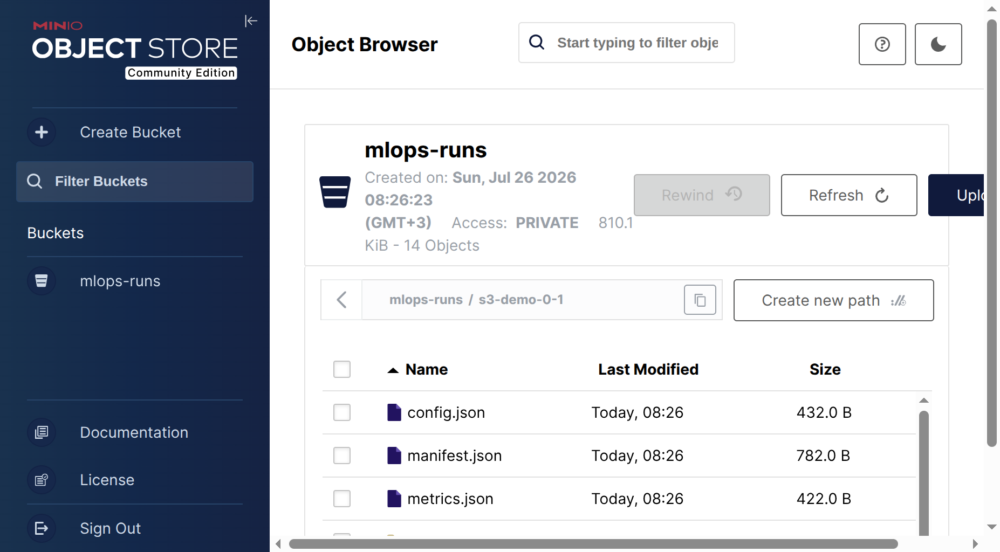
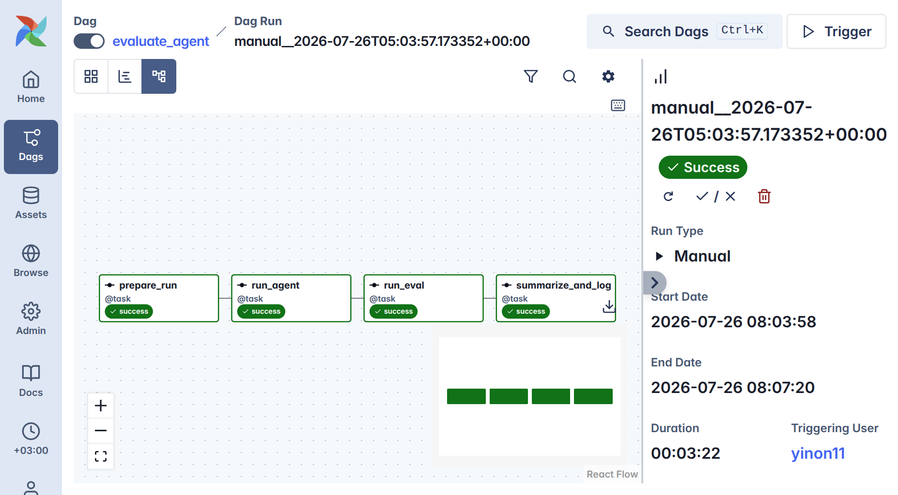
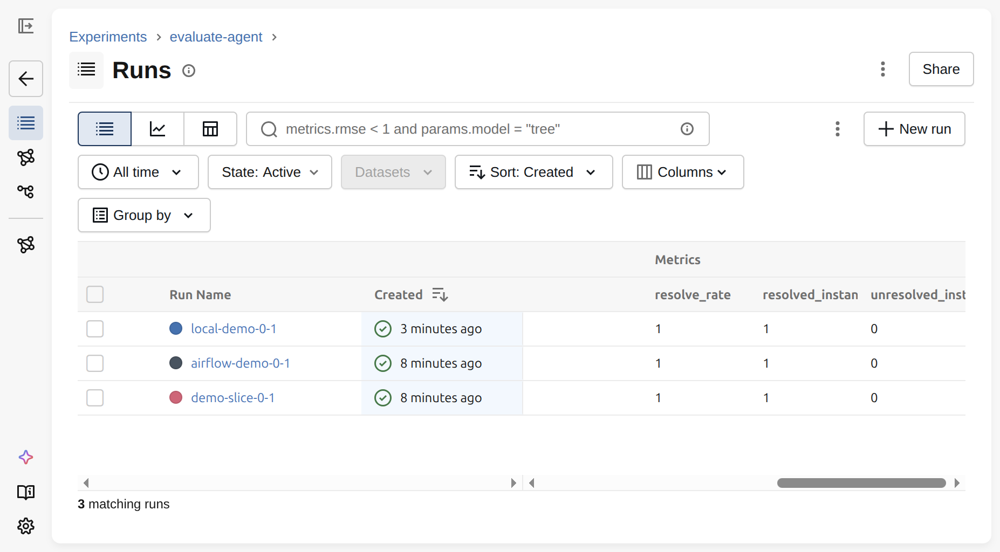
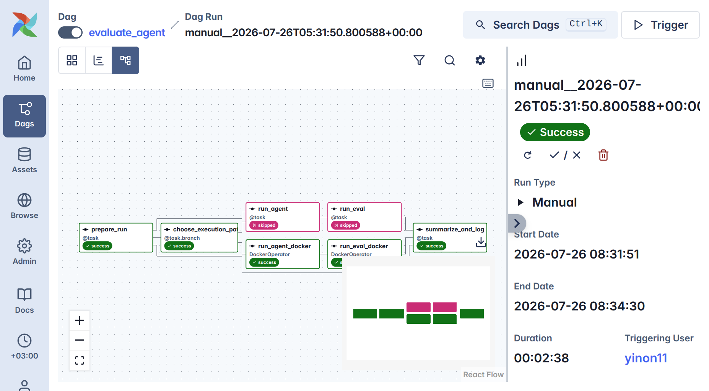

# REPORT — End-to-end coding-agent evaluation pipeline

**Course**: Nebius Academy — AI Performance Engineering, MLOps module  
**Assignment**: [mlops-assignment-e2e-ml-pipeline](https://github.com/minotru/mlops-assignment-e2e-ml-pipeline)  
**Repo**: https://github.com/yinon11/mlops-assignment-e2e-ml-pipeline

## Architecture

```
Airflow DAG evaluate_agent
  prepare_run  ->  run_agent  ->  run_eval  ->  summarize_and_log
       |              |              |                 |
       v              v              v                 v
  runs/<id>/     mini-swe-agent   SWE-bench       metrics.json
  config.json    -> preds.json    harness         + MLflow
                 + trajectories   -> logs/reports
                                   (run_id-scoped)
```

Helpers live in `pipeline/run_helpers.py` (`build_run_config`, `prepare_run_dir`,
`run_agent_batch`, `run_swebench_eval`, `collect_metrics`, `log_mlflow_run`).  
DAG: `dags/evaluate_agent.py`. CLI mirror: `scripts/run_evaluate_pipeline.py`.

**Airflow params**: `split`, `subset`, `workers`, `model`, `task_slice`, `run_id`, `cost_limit`.

`prepare_run` puts `run_dir` into the XCom config so later tasks do not re-derive the path.

## Deployment options

### A) Easy mode (what we used for the graded runs)

```bash
./run-mlflow.sh                 # :5000
./run-airflow-standalone.sh     # :8080  (admin/admin on our VM)
```

### B) Docker Compose — Airflow + MLflow (production-style)

Based on the [official Airflow 2.10.5 compose](https://airflow.apache.org/docs/apache-airflow/2.10.5/howto/docker-compose/index.html), plus an `mlflow` service and a custom `Dockerfile.airflow` image.

```bash
mkdir -p ./logs ./plugins ./config
# .env must contain NEBIUS_API_KEY and AIRFLOW_UID=$(id -u)
cp .env.example .env   # then edit secrets
docker compose build
docker compose up airflow-init
docker compose up -d
```

- Airflow UI: http://localhost:8080 (`airflow` / `airflow`)
- MLflow UI:  http://localhost:5000
- Project is mounted at `/opt/mlops`; workers see Docker via `/var/run/docker.sock`.

Standalone scripts remain available if you prefer not to run the full Celery stack for a tiny eval.

## How to trigger

```bash
# UI: unpause evaluate_agent, Trigger DAG w/ conf, or:
airflow dags unpause evaluate_agent
airflow dags trigger evaluate_agent --conf '{
  "split": "test",
  "subset": "verified",
  "workers": 1,
  "model": "nebius/moonshotai/Kimi-K2.6",
  "task_slice": "0:1",
  "run_id": "my-run",
  "cost_limit": 0
}'

# CLI (same helpers as the DAG):
set -a; source .env; set +a
sg docker -c 'uv run python scripts/run_evaluate_pipeline.py \
  --subset verified --split test --workers 1 \
  --task-slice 0:1 --run-id demo-slice-0-1'
```

## Artifact layout

```
runs/<run-id>/
  config.json
  metrics.json
  manifest.json
  run-agent/
    preds.json
    trajectories/
  run-eval/
    logs/run_evaluation/<run-id>/...
    reports/*.<run-id>.json
```

Eval logging is **run-id scoped**: only `logs/run_evaluation/<run_id>/` and
reports whose filename contains that `run_id` are copied into the run folder.
The shared project-root log tree is not bulk-copied (that previously caused
cross-run contamination).

## Object storage

Run artifacts are uploaded to S3-compatible object storage after each run:

- The Compose stack includes a **MinIO** service (`minio:9000`, console on `:9001`,
  `minioadmin`/`minioadmin`); the Airflow containers get `AWS_*` credentials,
  `AWS_S3_ENDPOINT_URL`, and `ARTIFACTS_BUCKET=mlops-runs` via the environment.
- `pipeline/run_helpers.py::upload_run_to_s3` uploads the whole `runs/<run-id>/`
  tree with boto3 (creating the bucket if needed) and returns the `s3://` URI.
  It degrades to a no-op with a warning when `ARTIFACTS_BUCKET`/boto3 are absent,
  so the pipeline works without object storage.
- The URI is recorded as `remote_artifact_uri` in `manifest.json` and logged to
  MLflow as the `artifact_uri` param.
- Verified locally: run `s3-demo-0-1` uploaded 14 files to
  `s3://mlops-runs/s3-demo-0-1/` (see `screenshots/object_storage_artifacts.png`).
- Swapping MinIO for real AWS S3 is just unsetting `AWS_S3_ENDPOINT_URL` and
  providing real credentials.



## Completed runs

Model `nebius/moonshotai/Kimi-K2.6`, SWE-bench Verified / test / slice `0:1`,
instance `astropy__astropy-12907`.

| Run id | How | Resolved | Artifacts |
|--------|-----|----------|-----------|
| `demo-slice-0-1` | CLI | **1 / 1** | `runs/demo-slice-0-1/` |
| `airflow-demo-0-1` | Airflow DAG `evaluate_agent` (`manual__2026-07-25T11:32:28.705836+00:00`, **success**) | **1 / 1** | `runs/airflow-demo-0-1/` |
| `local-demo-0-1` | Airflow DAG `evaluate_agent`, run locally (`manual__2026-07-26T05:03:57.173352+00:00`, **success**, 00:03:22) | **1 / 1** | `runs/local-demo-0-1/` |
| `s3-demo-0-1` | CLI, with object-storage upload | **1 / 1** | `runs/s3-demo-0-1/` + `s3://mlops-runs/s3-demo-0-1/` |
| `docker-demo-0-1` | Airflow DAG, **DockerOperator path** (`use_docker=true`, `manual__2026-07-26T05:31:50.800588+00:00`, **success**, 00:02:38) | **1 / 1** | `runs/docker-demo-0-1/` + `s3://mlops-runs/docker-demo-0-1/` |

MLflow experiment: `evaluate-agent`.  
Example MLflow run id (CLI): `c64283edd6724447ae9348ad1666186f`.

`total_instances: 500` in the SWE-bench aggregate report is the **dataset size**,
not the number of instances we evaluated (`submitted_instances` / `completed_instances` = 1).

The three most recent runs carry full agent trajectories in
`run-agent/trajectories/<instance-id>/`. The first two runs were executed on a
Nebius VM that has since been deleted; their `.traj.json` files were not copied
off it, so those two folders have trajectory directories without the per-instance
trajectory JSON. Everything else in them is complete.

## Screenshots



Airflow graph view of run `local-demo-0-1`: all four tasks green, run state **Success**.



MLflow experiment `evaluate-agent` with three runs and their `resolve_rate` /
`resolved_instances` / `unresolved_instances` metrics.



Run `docker-demo-0-1` with `use_docker=true`: the branch task routed execution to
`run_agent_docker` / `run_eval_docker` (DockerOperator, green); the subprocess
tasks were skipped.

## Rerun by run-id

1. Re-trigger with the same `run_id` (or copy params from `runs/<run-id>/config.json`).
2. Outputs land under that same folder.
3. Compare in MLflow by `model`, `task_slice`, `resolve_rate`.

```bash
uv run python scripts/run_evaluate_pipeline.py --skip-agent --run-id demo-slice-0-1
```

## Notes / trade-offs

- Retry/timeout policy: every task retries twice with exponential backoff (1 min base);
  `run_agent` has a 2 h execution timeout, `run_eval` 1 h, `prepare_run` and
  `summarize_and_log` 15 min each.
- Two execution paths for agent/eval, selected by the `use_docker` DAG param:
  the default `uv run` subprocess tasks, or `run_agent_docker` / `run_eval_docker`
  (`DockerOperator`, image `mlops-agent:latest` built from the root `Dockerfile`).
  A branch task picks the path per run; `summarize_and_log` joins with
  `trigger_rule="none_failed_min_one_success"`. The docker pair bind-mounts the
  project (host path via `MLOPS_HOST_PROJECT_ROOT`) and the Docker socket, since
  SWE-bench launches per-instance sibling containers either way.
- The DockerOperator path is defined only when `apache-airflow-providers-docker`
  is importable, so deployments without it still parse the DAG (subprocess path only).
- Batch CLI has no `--cost-limit` (only `swebench-single`); the param is logged for provenance.
- Root `Dockerfile` is the assignment agent image; `Dockerfile.airflow` is the compose image.
